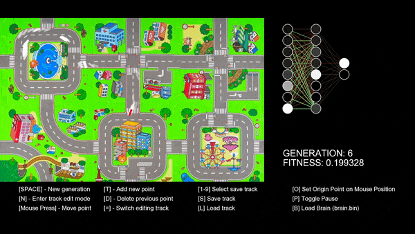
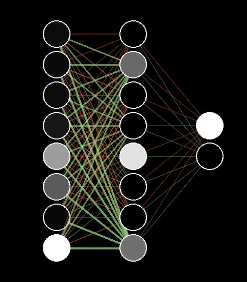
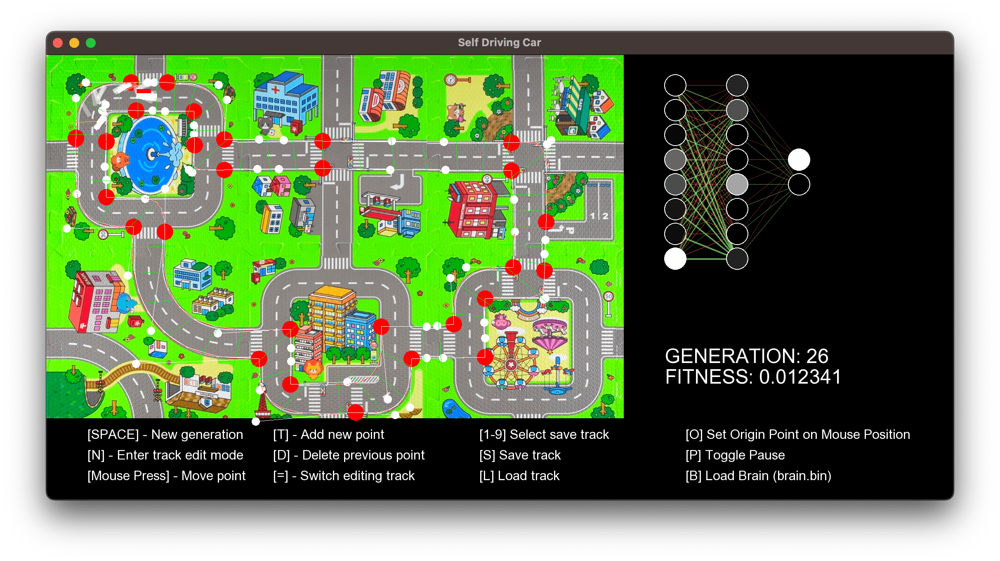

# Self Driving Car

Project made in C++ using graphic library SFML

## Neural Networks

Project uses neural networks and learns by [Genetic Algoritm](https://www.mathworks.com/help/gads/how-the-genetic-algorithm-works.html)

Logic behind neural network was made from scratch without using any libraries

## Track editor

There is track editor based on Bézier Curves, thanks to author of this [article](https://ciechanow.ski/drawing-bezier-curves/) i made beautiful curves which are also used for collisions. You can move, add, remove each point. Total amount of tracks is 9.

## Neural network inputs
Each car shoots 7 rays in front of him and the distance to the nearest wall is the input[0-7]

Input 8 is the car's velocity

## Fitness function
Each car's fintess is determined by taking total amount of checkpoints reached (green lines) + the distance to the nearest checkpoint

## Evolution
- 350 cars

- 0.05 mutation rate

- Crossover 
  - random genes from each parent

## Other functions

Saving brain of car (neural network) to binary file and loading it afterwards

## Special thanks

Thanks to [Grant Sanderson](https://www.youtube.com/c/3blue1brown), [Sebastian Lague](https://www.youtube.com/c/SebastianLague) and [Daniel Shiffman](https://www.youtube.com/c/TheCodingTrain) on theirs series of neural networks tutorials on YouTube

